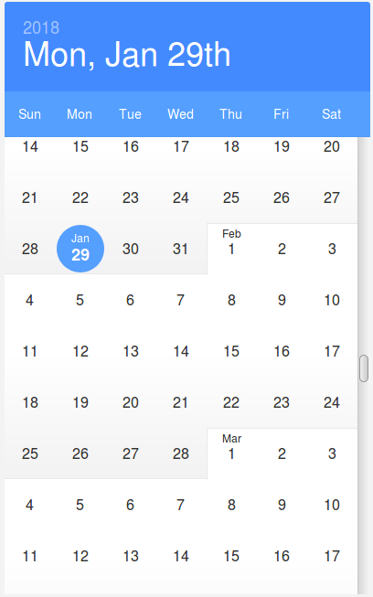
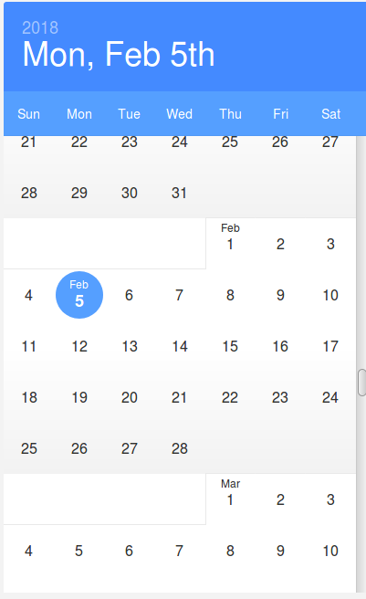

React Infinite Calendar — monthly break
=======================================

This is a fork of the awesome https://github.com/clauderic/react-infinite-calendar

The purpose of this fork is to force each month to go back to a new line in the calendar:

| Original repo | With monthly break |
|---------------|--------------------|
|  |  |

Every other feature / behavior should remain as close as possible to the main repository. Feel free to add issues / PRs on this repository if this is related to this very behavior.
